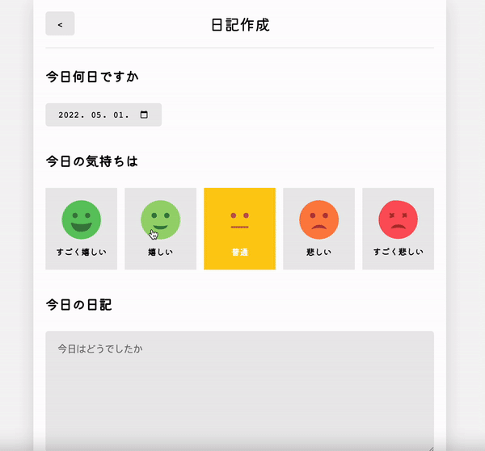

<!-- @format -->

# 📝 Emotion Diary Project （今日の日記は？）

## Project Period : 22.04.23 ~ 22.05.01 🎉

 

## Project Video

### Here is My Project deployed by Firebase 👇🏼

https://philipuuu-diary-project.web.app

 

## Project Stack

 

## 💡 About my project

✨ My first react project 'Emotion Diary' deployed with firebase

## 💡 Purpose of Project

- To learn react & javascript
  - JSX
  - Props
  - State
  - Hooks
  - LifeCycle
  - SPA & CSR
  - React Router v6
- Webpack & Babel
- Learn about Firebase

---

## ⚙️ What is a feature of a project?

### Home Page

- Google Fonts
- Latest, Oldest selection
- Emotion level selection
- Organize Diarys by year, month, day
- buttons with React Router V6 (Links, Navigator)
- Mobile UI & UX

### Diary Page

- Calendar
- Emotion Box selection
- Diary box with some restriction (at least 5 words required)
- Cancle button with React Router
- Create button saving in Local Storage

### Edit Page

Same with other components

### New Page

Same with other components

---

## 🚨 What was a difficulty with project?

State, Props, Hooks, React Router

---

## 🧑‍💻 What were good points of this project?

1. Need to study Javascript more because I had some difficult with some hooks & ES6 grammar

2. This was good course to learn React State & Props & Components

3. I deployed my project with Firebase first time but It wasn't that hard.

4. Tried to use Webpack, Bable. 'npm run build'
